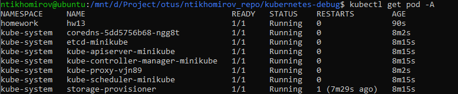
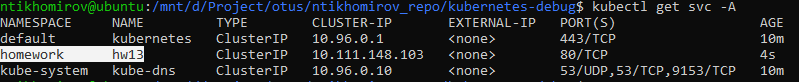
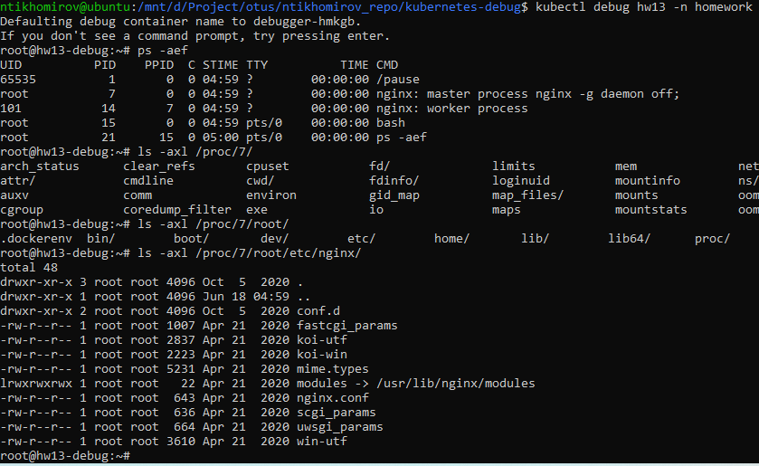
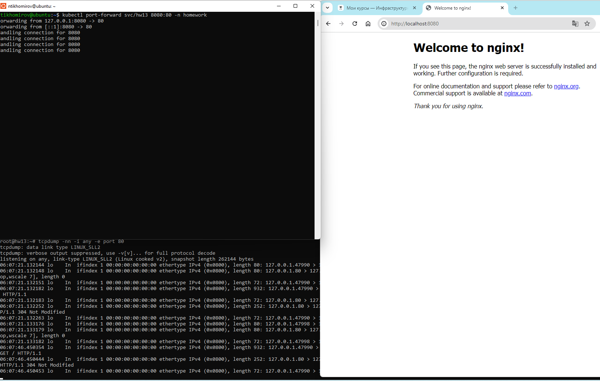
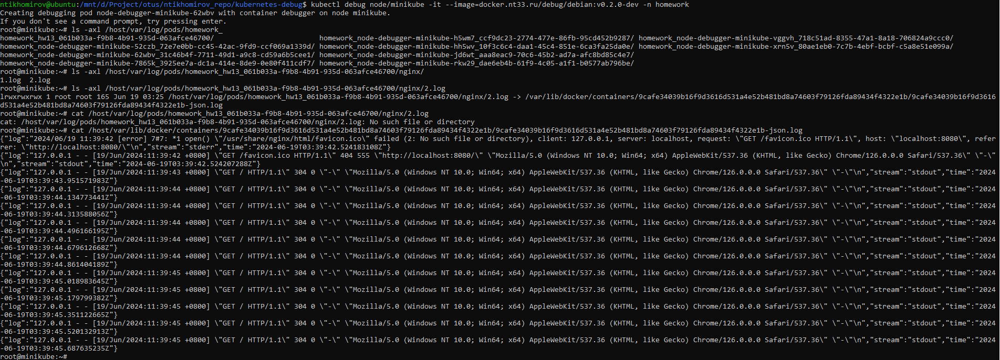
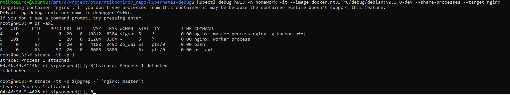

# Диагностика и отладка кластера и приложений в нем.

**Работы производим minikube**

## Подготовка окружения к ДЗ
1) Удаление старых настроек кластера - minikube delete
2) Запуск - minikube start

## Выполнение домашнего задания

1) Создаем namespace - kubectl apply -f ./namespace.yaml

2) Устанавливаем рекомендуемое приложение и создаем сервис к нему - kubectl apply -f ./pod.yaml

3) Проверяем, что все создалось и поднялось:
  - kubectl get pod -n homework
  - kubectl get svc -n homework

  

4) Душа требует утреннего костыля! Собираем свой собственный отладочный образ на основе debian и пушим его в репозитори:
  - docker build -t docker.nt33.ru/debug/debian:v0.1.0-dev .
  - docker push docker.nt33.ru/debug/debian:v0.1.0-dev

5) Создаем отладочный контейнер с шареными pid процессами (на основе docker.nt33.ru/debug/debian:v0.1.0-dev) - kubectl debug hw13 -n homework -it --copy-to=hw13-debug --image=docker.nt33.ru/debug/debian:v0.1.0-dev --share-processes

6) Командой ps находим pid процесса nginx. В директории /proc/{pid}/root/etc/nginx ls -axl

7) О слезы, о печаль, в образе отсутствует tcpdump. Пересобираем и пушим(не забываем про новый tag)

8) Запускаем эфимерный контейнер c образом содержащий tcpdump - kubectl debug hw13 -n homework -it --image=docker.nt33.ru/debug/debian:v0.2.0-dev --share-processes

9) Запускае новый контейнер для доступа к ноде:
  - Определяем на какой ноде находиться pod - kubectl get pod hw13 -n homework -o wide
  - Создание - kubectl debug node/minikube -it --image=docker.nt33.ru/debug/debian:v0.2.0-dev -n homework

10) Шок. Если пытаться открыть файл /host/var/log/pods/homework_hw13_061b033a-f9b8-4b91-935d-063afce46700/nginx/2.log, то получаем ошибку - No such file or directory. Делаем ls -axl /host/var/log/pods/homework_hw13_061b033a-f9b8-4b91-935d-063afce46700/nginx/2.log, получаем вывод lrwxrwxrwx 1 root root 165 Jun 19 03:25 /host/var/log/pods/homework_hw13_061b033a-f9b8-4b91-935d-063afce46700/nginx/2.log -> /var/lib/docker/containers/9cafe34039b16f9d3616d531a4e52b481bd8a74603f79126fda89434f4322e1b/9cafe34039b16f9d3616d531a4e52b481bd8a74603f79126fda89434f4322e1b-json.log. Это симлинк на директорию /var, но это примонтированная директория /host. Читаем файл - cat /host/var/lib/docker/containers/9cafe34039b16f9d3616d531a4e52b481bd8a74603f79126fda89434f4322e1b/9cafe34039b16f9d3616d531a4e52b481bd8a74603f79126fda89434f4322e1b-json.log. Все ок!

11) Копирования файла логов - kubectl cp node-debugger-minikube-7865k:/host/var/lib/docker/containers/9cafe34039b16f9d3616d531a4e52b481bd8a74603f79126fda89434f4322e1b/9cafe34039b16f9d3616d531a4e52b481bd8a74603f79126fda89434f4322e1b-json.log json.log -n homework

12) Использование команды strace:
 - создаем эфимерный контейнер - kubectl debug hw13 -n homework -it --image=docker.nt33.ru/debug/debian:v0.3.0-dev --share-processes --target nginx
 - подключаемся к процессу по пид - strace -tt -p $(pgrep -f 'nginx: master')

