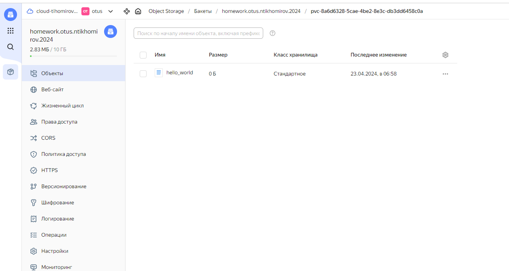
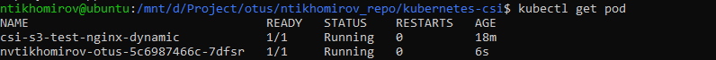
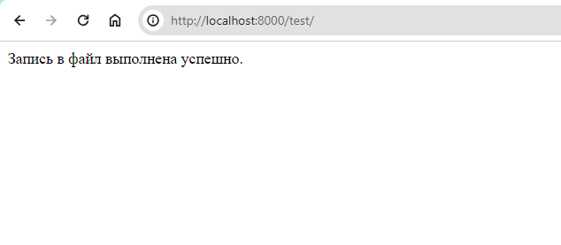
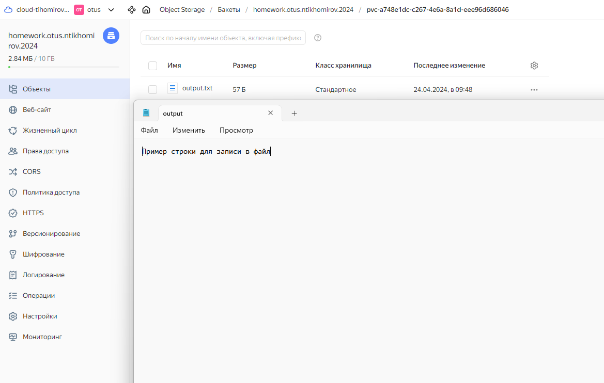

# Установка и использование CSI драйвера

**Работы производим YC**

## Подготовка окружения к ДЗ
1) Скачиваем и устанавливаем terraform c зеркала яндекс - https://hashicorp-releases.yandexcloud.net/terraform/

2) Устанавливаем необходимые модули для работы terraform c yc

3) Устанавливаем yc для работы с cloud через cli

4) Настраиваем terraform для домашнего задания

5) Производим инициализацию и запуск кластера - terraform init; terraform plan; terraform apply

6) Производим конфигурация Kubectl

## Выполнение домашнего задания
>Всю конфигурацию для ДЗ производим в соответствии с рекомендациями от YC

1) Создаем храненилище S3 для ДЗ (преиспользуем хранилище и account c прошлого задания)

2) Создайте secret c ключами для доступа к Object Storage - kubectl create -f ./secret.yaml

3) Установите CSI driver (предварительно скачав его с репозитория)
  - kubectl create -f k8s-csi-s3/deploy/kubernetes/provisioner.yaml
  - kubectl create -f k8s-csi-s3/deploy/kubernetes/driver.yaml
  - kubectl create -f k8s-csi-s3/deploy/kubernetes/csi-s3.yaml

4) Создайте storageClass - kubectl create -f storageclass.yaml

5) Создаем динамический PVC - kubectl create -f pvc-dynamic.yaml

6) Создание pod на основе пример yc - kubectl create -f ./pod-dynamic.yaml

7) Как доп. задание сделал файл deployment.yaml c раскаткай собранного образа на основе openresty - kubectl create -f ./deployment.yaml

## Проверка выполнения ДЗ по скринам

### Полезные команды
- Вывод списка кластеров и их статус - yc k8s cluster list
- Вывод информации о кластере - yc k8s cluster get homework-otus

- Создание временного токена (для подключения terraform к yc) - yc iam create-token
- Переконфигурация kubectl config
  - yc managed-kubernetes cluster list
  - yc managed-kubernetes cluster get-credentials k8s-cluster-zdll5iec --external --force
- Проброс портов - kubectl port-forward nvtikhomirov-otus-5c6987466c-7dfsr 8000:8000
