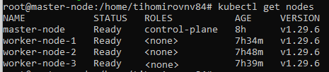

# Подходы к развертыванию и обновлению production-grade кластера

**Работы производим YC**

## Подготовка окружения к ДЗ
1) Создать 4VM

## Выполнение домашнего задания
### Набор команд для настройки мастер ноды
```bash
#!/bin/bash
apt update
apt install mc containerd -y
systemctl enable containerd
systemctl start containerd
curl -fsSL https://pkgs.k8s.io/core:/stable:/v1.29/deb/Release.key | sudo gpg --dearmor -o /etc/apt/keyrings/kubernetes-apt-keyring.gpg
echo 'deb [signed-by=/etc/apt/keyrings/kubernetes-apt-keyring.gpg] https://pkgs.k8s.io/core:/stable:/v1.29/deb/ /' | sudo tee /etc/apt/sources.list.d/kubernetes.list
apt update
apt install kubeadm kubelet kubectl -y
apt-mark hold kubeadm kubelet kubectl
kubeadm version
swapoff -a
sed -i '/ swap / s/^\(.*\)$/#\1/g' /etc/fstab
echo "overlay" >> /etc/modules-load.d/containerd.conf
echo "br_netfilter" >> /etc/modules-load.d/containerd.conf
modprobe overlay
modprobe br_netfilter
echo "net.bridge.bridge-nf-call-ip6tables = 1" >> /etc/sysctl.d/kubernetes.conf
echo "net.bridge.bridge-nf-call-iptables = 1" >> /etc/sysctl.d/kubernetes.conf
echo "net.ipv4.ip_forward = 1" >> /etc/sysctl.d/kubernetes.conf
sysctl --system
echo 'KUBELET_EXTRA_ARGS="--cgroup-driver=cgroupfs"' >> /etc/default/kubelet
systemctl daemon-reload && systemctl restart kubelet
kubeadm init --control-plane-endpoint=master-node --upload-certs >> logs.txt
mkdir -p $HOME/.kube
cp -i /etc/kubernetes/admin.conf $HOME/.kube/config
chown $(id -u):$(id -g) $HOME/.kube/config
kubectl apply -f https://github.com/flannel-io/flannel/releases/latest/download/kube-flannel.yml
kubectl taint nodes --all node-role.kubernetes.io/control-plane-
systemctl stop apparmor && systemctl disable apparmor
systemctl restart containerd.service
```

### Набор команд для настройки рабочих нод
```bash
#!/bin/bash
apt update
apt install mc containerd -y
systemctl enable containerd
systemctl start containerd
curl -fsSL https://pkgs.k8s.io/core:/stable:/v1.29/deb/Release.key | sudo gpg --dearmor -o /etc/apt/keyrings/kubernetes-apt-keyring.gpg
echo 'deb [signed-by=/etc/apt/keyrings/kubernetes-apt-keyring.gpg] https://pkgs.k8s.io/core:/stable:/v1.29/deb/ /' | sudo tee /etc/apt/sources.list.d/kubernetes.list
apt update
apt install kubeadm kubelet kubectl -y
apt-mark hold kubeadm kubelet kubectl
kubeadm version
swapoff -a
sed -i '/ swap / s/^\(.*\)$/#\1/g' /etc/fstab
echo "overlay" >> /etc/modules-load.d/containerd.conf
echo "br_netfilter" >> /etc/modules-load.d/containerd.conf
modprobe overlay
modprobe br_netfilter
echo "net.bridge.bridge-nf-call-ip6tables = 1" >> /etc/sysctl.d/kubernetes.conf
echo "net.bridge.bridge-nf-call-iptables = 1" >> /etc/sysctl.d/kubernetes.conf
echo "net.ipv4.ip_forward = 1" >> /etc/sysctl.d/kubernetes.conf
sysctl --system
echo 'KUBELET_EXTRA_ARGS="--cgroup-driver=cgroupfs"' >> /etc/default/kubelet
systemctl daemon-reload && systemctl restart kubelet
kubectl taint nodes --all node-role.kubernetes.io/control-plane-
systemctl stop apparmor && systemctl disable apparmor
systemctl restart containerd.service
```

### Подключение рабочих нод к мастер ноде (взять из файла вывода - logs.txt)
```
kubeadm join master-node:6443 --token hksl38.z2pllr8f6mcbwefo \
      --discovery-token-ca-cert-hash sha256:70b7e9e591fa6f76b50725881e02b974f056e1709114c9ed04610ae432f736ea \
      --control-plane --certificate-key ff08541b815655bb1b491e21ff75c7de98beb961b99d78be65edd2a9cc972739
```


## Процесс обновления
### Подготовительные работы и обновление мастер ноды
```
#!/bin/bash
curl -fsSL https://pkgs.k8s.io/core:/stable:/v1.30/deb/Release.key | sudo gpg --dearmor -o /etc/apt/keyrings/kubernetes-apt-keyring.gpg
echo 'deb [signed-by=/etc/apt/keyrings/kubernetes-apt-keyring.gpg] https://pkgs.k8s.io/core:/stable:/v1.30/deb/ /' | sudo tee /etc/apt/sources.list.d/kubernetes.list
apt update
apt-cache madison kubeadm | tac
apt-mark unhold kubeadm
apt-get update && apt-get install -y kubeadm=1.30.2-1.1
apt-mark hold kubeadm
kubeadm upgrade node
kubectl drain master-node --ignore-daemonsets --delete-local-data
apt-mark unhold kubelet kubectl
apt-get update
apt-get install -y kubelet=1.30.2-1.1 kubectl=1.30.2-1.1
apt-mark hold kubelet kubectl
systemctl daemon-reload
systemctl restart kubelet
kubectl uncordon master-node
kubectl get nodes
```

### Подготовительные работы и обновление рабочих нод
```
#!/bin/bash
curl -fsSL https://pkgs.k8s.io/core:/stable:/v1.30/deb/Release.key | sudo gpg --dearmor -o /etc/apt/keyrings/kubernetes-apt-keyring.gpg
echo 'deb [signed-by=/etc/apt/keyrings/kubernetes-apt-keyring.gpg] https://pkgs.k8s.io/core:/stable:/v1.30/deb/ /' | sudo tee /etc/apt/sources.list.d/kubernetes.list
apt update
apt-mark unhold kubeadm
apt-get update && apt-get install -y kubeadm=1.30.2-1.1
apt-mark hold kubeadm
kubeadm upgrade node
kubectl drain worker-node-3 --ignore-daemonsets
apt-mark unhold kubelet kubectl
apt-get update
apt-get install -y kubelet=1.30.2-1.1 kubectl=1.30.2-1.1
apt-mark hold kubelet kubectl
systemctl daemon-reload
systemctl restart kubelet
```


## Задание со *
### Подготовка обновляем VM и устанавливаем ansible
```bash
#!/bin/#!/usr/bin/env bash
apt update
apt install software-properties-common
add-apt-repository --yes --update ppa:ansible/ansible
apt install ansible
ansible --version
```

Это не сработало!!! (Версия слишком низкая)


### Не печалимся! Создаем виртуальное окружение для работы kubespray и устанавливаем ansible
```
#!/bin/bash
apt-get install -y python3-pip python3-venv
python3 -m venv kubespray
source kubespray/bin/activate
git clone https://github.com/kubernetes-sigs/kubespray.git
pip install -U -r requirements.txt
ansible-playbook -i inventory/ya-hw14/inventory.ini -u nvtikhomirov --become --become-user=root cluster.yml
```
#### Немного магии в вывод:

